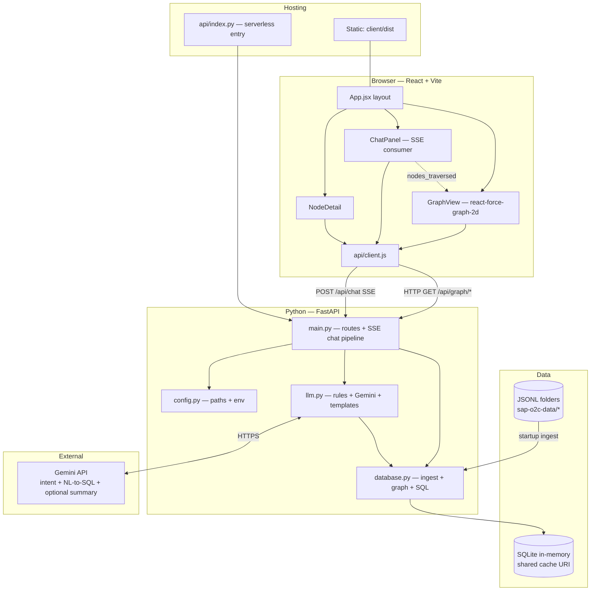

# SAP Order-to-Cash Graph Explorer


**Live demo:** [https://sap-o2c-graph.vercel.app](https://sap-o2c-graph-beta.vercel.app/).

Interactive graph exploration and a natural-language chat over SAP O2C JSONL data. Answers are **executed against SQLite** (SELECT-only SQL or curated trace queries), not invented by the model.

---

## System design 

<table>
<thead>
<tr>
<th>Layer</th>
<th>Technologies</th>
<th>Role</th>
</tr>
</thead>
<tbody>
<tr>
<td><strong>Frontend</strong></td>
<td>React 19, Vite 6, <code>@vitejs/plugin-react</code></td>
<td>SPA, dev server, production build to <code>client/dist</code></td>
</tr>
<tr>
<td><strong>Graph UI</strong></td>
<td><code>react-force-graph-2d</code></td>
<td>Force-directed canvas graph, zoom, pan, expand-on-click</td>
</tr>
<tr>
<td><strong>Backend</strong></td>
<td>Python 3, FastAPI 0.115, Uvicorn 0.34</td>
<td>REST API, SSE chat stream, app lifespan / DB init</td>
</tr>
<tr>
<td><strong>Data</strong></td>
<td>SQLite 3 (stdlib), in-memory shared-cache URI</td>
<td>JSONL ingestion, relational schema, graph projection via SQL</td>
</tr>
<tr>
<td><strong>LLM</strong></td>
<td>Google Gemini via <code>google-generativeai</code> 0.8; <code>python-dotenv</
code></td>
<td>Intent fallback, NL→SQL, optional result summary; model from 
<code>GEMINI_MODEL</code></td>
</tr>
<tr>
<td><strong>Deploy</strong></td>
<td>Vercel, <code>vercel.json</code>, <code>api/index.py</code></td>
<td>Static client + serverless Python entry importing FastAPI app</td>
</tr>
<tr>
<td><strong>Dataset</strong></td>
<td>JSONL under <code>sap-order-to-cash-dataset/sap-o2c-data/</code></td>
<td>Knowledge base, ground truth</td>
</tr>
</tbody>
</table>



**Application Flow:** The client loads the SPA, calls REST for the graph, and opens an SSE stream for chat. `main.py` orchestrates classify → validate → query → format. `database.py` owns ingestion, indexes, graph projection, and safe SQL. `llm.py` supplies rules-first routing, optional Gemini calls, and response templates. The dataset is read once at startup into in-memory SQLite.


---

## 1. Dataset: what it is and what we use

### Source layout

Under `sap-order-to-cash-dataset/sap-o2c-data/`, each entity type is one or more `part-*.jsonl` files.

### Ingested into the application

<table>
<thead>
<tr>
<th>JSONL folder</th>
<th>Target table(s)</th>
<th>Role in O2C</th>
</tr>
</thead>
<tbody>
<tr>
<td><code>business_partners</code> + <code>business_partner_addresses</code></td>
<td><code>customers</code></td>
<td>Sold-to party; address fields merged into one row per customer.</td>
</tr>
<tr>
<td><code>sales_order_headers</code></td>
<td><code>sales_orders</code></td>
<td>Order header, amounts, status.</td>
</tr>
<tr>
<td><code>sales_order_items</code></td>
<td><code>sales_order_items</code></td>
<td>Line items, material, plant.</td>
</tr>
<tr>
<td><code>outbound_delivery_headers</code></td>
<td><code>deliveries</code></td>
<td>Delivery documents.</td>
</tr>
<tr>
<td><code>outbound_delivery_items</code></td>
<td><code>delivery_items</code></td>
<td>Links each delivery to sales order and line via reference fields.</td>
</tr>
<tr>
<td><code>billing_document_headers</code></td>
<td><code>billing_documents</code></td>
<td>Billing header; cancellation flag from source.</td>
</tr>
<tr>
<td><code>billing_document_items</code></td>
<td><code>billing_items</code></td>
<td>Links billing to delivery and material.</td>
</tr>
<tr>
<td><code>journal_entry_items_accounts_receivable</code></td>
<td><code>journal_entries</code></td>
<td>AR line items; <code>reference_doc</code> points to billing document.</td>
</tr>
<tr>
<td><code>payments_accounts_receivable</code></td>
<td><code>payments</code></td>
<td>Cleared against journal via matching <code>clearing_doc</code>.</td>
</tr>
<tr>
<td><code>plants</code></td>
<td><code>plants</code></td>
<td>Plant master.</td>
</tr>
<tr>
<td><code>products</code> + <code>product_descriptions</code></td>
<td><code>products</code></td>
<td>Material master plus description text.</td>
</tr>
</tbody>
</table>

**Normalization choices:** Composite primary keys for line-level rows (e.g. `{order}-{item}`) where the source uses split keys. Amounts as `REAL`, dates as ISO strings. `INSERT OR IGNORE` / `INSERT OR REPLACE` used where duplicate keys can appear across parts.

### Present in the bundle but not loaded into SQLite

Examples: `sales_order_schedule_lines`, `customer_company_assignments`, `customer_sales_area_assignments`, `product_plants`, `product_storage_locations`, standalone `billing_document_cancellations` folder. They were omitted to keep the **core O2C path** (order → delivery → billing → journal → payment) small, verifiable, and fast to load. Extending ingestion would mean new tables and edges, not a redesign.

---

## 2. Graph model 

We do **not** store a second “graph database.” The **graph is a projection** of relational data:

- **Node IDs:** Typed prefixes — `CUST-`, `SO-`, `SOI-`, `DLV-`, `DLI-`, `BILL-`, `BLI-`, `JE-`, `PAY-`, `PRD-`, `PLT-`.
- **Root graph (`build_graph_root`):** Customers, orders, deliveries, billing documents, journal entries, payments; edges follow the main chain: Customer→Order→Delivery→Billing→Journal→Payment (with joins matching real keys).
- **Expand (`expand_node`):** One-hop neighbors per entity type via SQL (e.g. order → customer, line items, deliveries).

This matches the assignment’s “trace the flow” and “expand neighbors” without operational cost of Neo4j on serverless.

---

## 3. How the application was built 

1. **Schema + ingestion** — Defined 11 tables aligned to SAP entities; wrote `_load_jsonl` + `_ingest_all` to map JSON fields to columns; added 14 indexes on foreign keys and join columns.
2. **Graph API** — Implemented `build_graph_root`, `expand_node`, `get_node_detail`, `get_stats` on top of SQL.
3. **O2C analytics** — `trace_order_flow`, `trace_billing_flow`, `top_products_by_billing`, `find_incomplete_orders`, `get_customer_orders`, etc., all return structured dicts and often `nodes_traversed` for UI highlighting.
4. **FastAPI surface** — Single `main.py`: REST under `/api/graph/*`, health, and `POST /api/chat` as **Server-Sent Events**.
5. **LLM layer** — `llm.py`: regex-first intent + parameter extraction; rule-generated SQL for common analytics; Gemini for intent/SQL when rules miss; template formatters for answers; optional short summarization for large SQL results; timeouts on API calls.
6. **Guardrails** — `validate_intent`, `UNKNOWN` for off-topic, `run_sql` SELECT-only + keyword denylist, clarifications for missing IDs.
7. **Frontend** — React + Vite + `react-force-graph-2d`; chat consumes SSE; graph highlights when `result` includes `nodes_traversed`.
8. **Deploy** — Vercel: static build + `api/index.py` re-exporting the FastAPI app; `vercel.json` rewrites `/api/*` to the Python function.

---

## 4. Technology choices and reasoning

<table>
<thead>
<tr>
<th>Choice</th>
<th>Reason</th>
</tr>
</thead>
<tbody>
<tr>
<td><strong>SQLite in-memory (shared cache)</strong></td>
<td>Fits dataset size; no external database for local dev or Vercel; sub-ms queries with indexes; cold start loads JSONL in tens of milliseconds.</td>
</tr>
<tr>
<td><strong>Relational plus graph projection</strong></td>
<td>Full auditability: any path can be checked with plain SQL. A native graph database would be heavier to run on free serverless tiers.</td>
</tr>
<tr>
<td><strong>FastAPI</strong></td>
<td>Async-friendly, OpenAPI docs, single clear application module for the assignment.</td>
</tr>
<tr>
<td><strong>Gemini</strong> (<code>GEMINI_MODEL</code> in env)</td>
<td>Managed API suited to JSON and SQL-shaped outputs; model is configurable per environment.</td>
</tr>
<tr>
<td><strong>Rules before LLM</strong></td>
<td>Lower latency and cost: most demo questions resolve with regex and fixed SQL; the LLM runs only when rules miss. More deterministic for repeated grading.</td>
</tr>
<tr>
<td><strong>Template responses</strong></td>
<td>Avoids a second LLM call for formatting; consistent structure (summary, insights, optional SQL and raw details).</td>
</tr>
<tr>
<td><strong>React plus force-directed graph</strong></td>
<td>WebGL or canvas performance for many nodes; supports explore-and-expand without a custom renderer.</td>
</tr>
</tbody>
</table>

---

## 5. Latency and efficiency

- **In-process cache** (`@_cached` in `database.py`) on read-mostly functions (e.g. stats, top products, incomplete orders) — safe because the dataset is static after load.
- **Indexed joins** on every heavy foreign key used in traces and expands.
- **Rule-based intent + inline SQL** avoids two LLM round-trips for common questions.
- **`generate_sql`** includes recent conversation lines when history is passed, for follow-ups without re-explaining entities.
- **Thread pool + timeout** around Gemini calls in `llm.py` to avoid hung requests.
- **SSE** sends status/intent/result/answer so the UI stays responsive while work runs.

---

## 6. LLM integration, prompting, and hyperparameters

All Gemini calls go through `_call_llm` in `server/llm.py`: a shared 
**`GenerationConfig`** and a **hard wall-clock timeout** so behavior is 
predictable and the API cannot hang indefinitely.

### Hyperparameters (determinism and limits)

These values are fixed in code (not tuned per request) so outputs stay **as deterministic as the API allows** and costs stay bounded.

<table>
<thead>
<tr>
<th>Parameter</th>
<th>Value</th>
<th>Purpose</th>
</tr>
</thead>
<tbody>
<tr>
<td><code>temperature</code></td>
<td><strong>0.0</strong></td>
<td>Minimizes randomness for routing JSON, SQL, and short summaries—same prompt 
should yield the same structured answer under normal API behavior.</td>
</tr>
<tr>
<td><code>max_output_tokens</code></td>
<td><strong>2048</strong> (intent classification)</td>
<td>Enough for a single JSON object; set on <code>_llm_classify</code> via 
<code>_call_llm(..., max_tokens=2048)</code>.</td>
</tr>
<tr>
<td><code>max_output_tokens</code></td>
<td><strong>4096</strong> (NL→SQL)</td>
<td><code>generate_sql()</code> may return longer multi-line <code>SELECT</code> 
statements.</td>
</tr>
<tr>
<td><code>max_output_tokens</code></td>
<td><strong>512</strong> (optional SQL summary)</td>
<td><code>summarize_sql_result()</code> only needs a short natural-language 
paragraph.</td>
</tr>
<tr>
<td>Request timeout</td>
<td><strong>15 seconds</strong> (<code>_LLM_TIMEOUT</code>)</td>
<td><code>ThreadPoolExecutor</code> wraps <code>generate_content</code>; on 
timeout or error, intent falls back to <code>UNKNOWN</code> or rule-based SQL 
where possible.</td>
</tr>
<tr>
<td>Executor pool</td>
<td><strong>max_workers = 2</strong></td>
<td>Caps concurrent Gemini calls per process.</td>
</tr>
<tr>
<td>Model id</td>
<td><code>GEMINI_MODEL</code> env (see <code>server/.env.example</code>)</td>
<td>Default in <code>config.py</code> if unset; swap model without code changes.
</td>
</tr>
</tbody>
</table>

**Note:** Temperature 0 does not guarantee bitwise-identical strings across days 
or model updates (provider-side changes still apply). For **fully 
deterministic** answers to fixed questions, the system relies primarily on 
**rules + SQL + templates**; the LLM is a fallback path.

### When the optional summarizer runs

In `server/main.py`, after template formatting for `SQL_QUERY`, an extra LLM 
summary is called only if **`count &gt; 10` and more than four columns**—narrow 
results stay template-only for speed and stability.

### Prompting strategy

**Intent (fallback):** Prompt lists fixed intents and requires **JSON only**; 
instructs `SQL_QUERY` for analytics and `UNKNOWN` for unrelated; last messages 
appended when context words appear (“this”, “that”, etc.).

**NL → SQL:** Prompt embeds a **full schema summary** (tables, columns, 
relationships). Asks for **SELECT-only** SQL with LIMIT. Recent conversation 
lines are included when history is passed into `generate_sql`.

**Optional summarization:** For large, wide `SQL_QUERY` results, a short Gemini 
pass turns row samples into a concise paragraph; most answers use **templates** 
instead.

---

## 7. Guardrails

- **Pre-classification:** Greetings and obvious off-topic patterns → no data access; `UNKNOWN` with a domain-only message.
- **Post-classification:** `validate_intent` ensures required params; missing IDs → clarification strings.
- **SQL execution:** Only statements starting with `SELECT`; blocked keywords: `drop`, `delete`, `update`, `insert`, `alter`, `create`, `pragma`, `attach`.
- **API key:** Chat returns a clear configuration error if `GEMINI_API_KEY` is unset (local/Vercel env).

---

## 8. Optional extensions (bonus) — implemented?

<table>
<thead>
<tr>
<th>Extension</th>
<th>Status</th>
<th>How it is implemented</th>
</tr>
</thead>
<tbody>
<tr>
<td>Natural language to SQL or graph-style query</td>
<td><strong>Yes</strong></td>
<td>Rules emit SQL for many phrasings; otherwise <code>generate_sql()</code> then <code>run_sql()</code>. Fixed intents, such as traces, use handwritten SQL in <code>database.py</code>, not Cypher.</td>
</tr>
<tr>
<td>Highlight nodes referenced in responses</td>
<td><strong>No</strong></td>
<td>Trace and customer-order style handlers set <code>nodes_traversed</code>. <code>main.py</code> includes that list on the SSE <code>result</code> event. <code>ChatPanel</code> calls <code>onHighlightNodes</code>; <code>GraphView</code> highlights those graph node IDs. It does work, but not to the extent described in the assessment.</td>
</tr>
<tr>
<td>Semantic or hybrid search</td>
<td><strong>Partial</strong></td>
<td>Hybrid here means rules plus database lookup: <code>find_customer_by_name</code> and <code>find_product_by_name</code> use case-insensitive <code>LIKE</code> matching. Resolved names feed intent routing and SQL. There is no embedding or vector index.</td>
</tr>
<tr>
<td>Streaming responses</td>
<td><strong>Yes</strong></td>
<td>Server-Sent Events with event types <code>status</code>, <code>intent</code>, <code>result</code>, <code>answer</code>, <code>done</code>. The assistant reply body is one <code>answer</code> event, not token-by-token LLM streaming.</td>
</tr>
<tr>
<td>Conversation memory</td>
<td><strong>Yes</strong></td>
<td>The client sends the last ten messages with each chat request. The server passes history into <code>classify_intent</code> and into <code>SQL_QUERY</code> parameters for <code>generate_sql</code>.</td>
</tr>
<tr>
<td>Graph clustering or advanced analysis</td>
<td><strong>No</strong></td>
<td>No community detection or clustering algorithms. Layout is force-directed visualization only.</td>
</tr>
</tbody>
</table>

---

## 9. Repository structure 

<table>
<thead>
<tr>
<th>Path</th>
<th>Purpose</th>
</tr>
</thead>
<tbody>
<tr>
<td><code>client/src/</code></td>
<td>React UI: <code>App.jsx</code>, <code>components/*</code>, <code>api/client.js</code></td>
</tr>
<tr>
<td><code>server/</code></td>
<td>FastAPI app, database layer, LLM layer: <code>main.py</code>, <code>database.py</code>, <code>llm.py</code>, <code>config.py</code></td>
</tr>
<tr>
<td><code>api/index.py</code></td>
<td>Vercel serverless entry: imports the FastAPI application from <code>server/</code></td>
</tr>
<tr>
<td><code>sap-order-to-cash-dataset/sap-o2c-data/</code></td>
<td>Source JSONL dataset</td>
</tr>
<tr>
<td><code>vercel.json</code></td>
<td>Frontend build command, output directory, and <code>/api</code> rewrite to Python</td>
</tr>
</tbody>
</table>

---

## 10. Local setup
### Prerequisites
- Python 3.10+
- Node.js 18+ and npm
- A Google Gemini API key ([get one here](https://aistudio.google.com/app/apikey))

```bash
Backend (terminal 1)
cd server
python -m venv venv && source venv/bin/activate   # Windows: venv\Scripts\activate
pip install -r requirements.txt
cp .env.example .env   # then edit .env and paste your GEMINI_API_KEY
python -m uvicorn main:app --host 0.0.0.0 --port 8000

The server loads the dataset from ../sap-order-to-cash-dataset/sap-o2c-data/ on startup.

Frontend (terminal 2)
cd client
npm install
npm run dev
```

Configure `VITE_API_BASE` if the API is not same-origin (e.g. split ports during dev).

**Vercel:** Set `GEMINI_API_KEY` in project environment variables. Build uses `vercel.json`.

---


